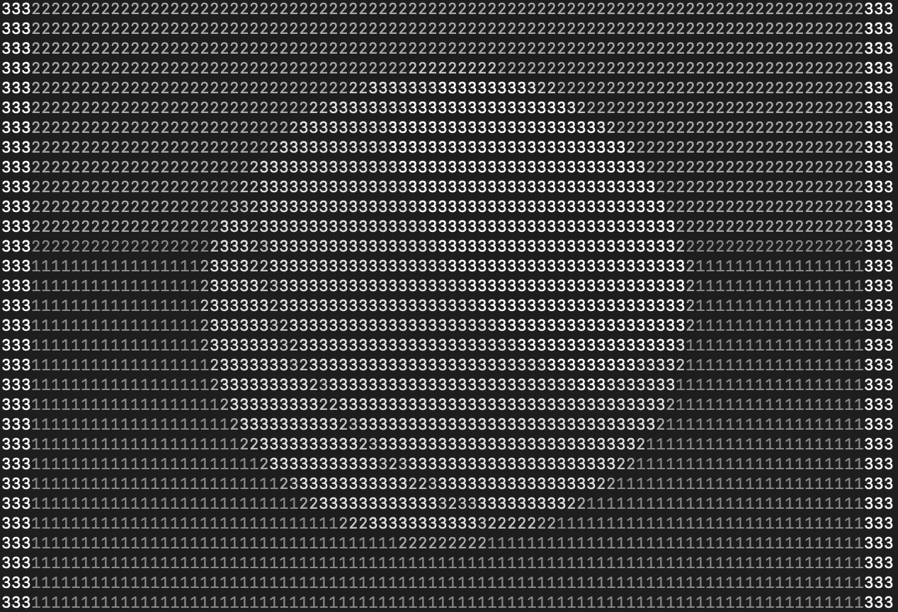
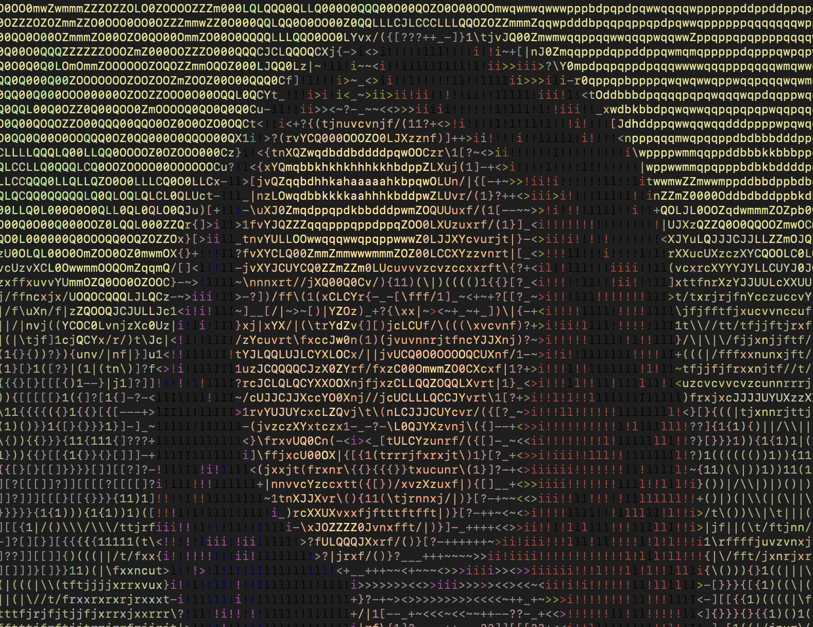
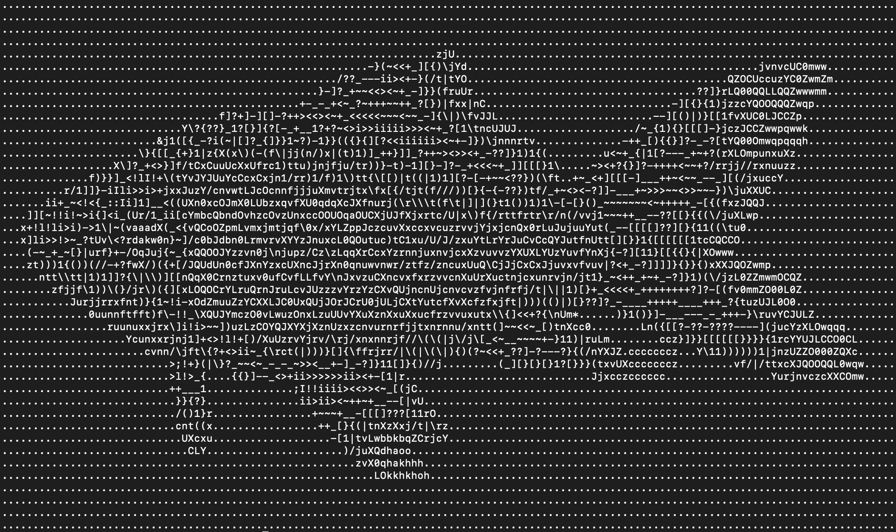
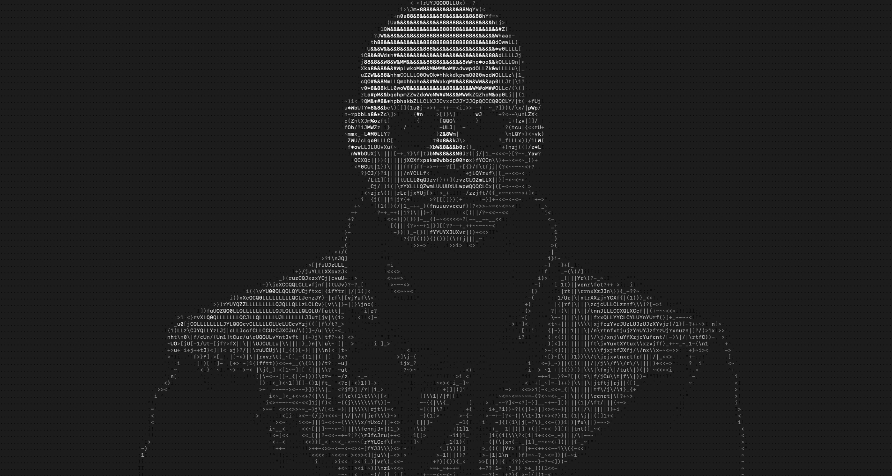

# image2ascii

Convert images to custom ASCII art with code or from the command-line. Print images to the console in a fun way, and take advantage of io/console terminal width to make the art based on window size!

Prerequisites
----------

Requires ImageMagick which can be downloaded [here](https://imagemagick.org/script/download.php)

Installation
----------

`$ gem install image2ascii`

Use from command-line
----------

      Usage: ascii2image [image path or URL] [options]
        -w, --width N                    Width (in characters)
        -t, --terminal-percent N         Width as percent of terminal size
        -c, --color COLOR                Color in hex, rgb, or by name [examples: 'red', '255, 255, 255', '#FFFFFF']
        -x, --custom CHARS               Custom characters in order of descending relative brightness [example: '@#-.']
        -i, --invert                     Invert ASCII character order
        -b, --block                      Print ASCII in block form
        -g, --greyscale                  Print ASCII in greyscale
        -h, --help                       Prints this help

Use with code
----------

  #### - With defaults -

      require "image2ascii"
      
      ascii = Image2ASCII.new("/path/to/img.jpg")
      ascii.generate
      
      ascii = Image2ASCII.new("http://www.realclearlife.com/wp-content/uploads/2018/03/MonaLisa.jpg")
      ascii.generate
      
  #### - Change width -
  
        ascii = Image2ASCII.new("/path/to/img.jpg")
        
        ascii.generate(width: 30)
        ascii.generate(width: ascii.winsize)        #default
        ascii.generate(width: ascii.winsize / 2)    #half of window size
        
  #### - Change color -
  
        ascii = Image2ASCII.new("/path/to/img.jpg")
        
        ascii.generate(color: "full")          #default
        ascii.generate(color: "greyscale")
        ascii.generate(color: "#FFFFFF")
        ascii.generate(color: [255, 255, 255])
        ascii.generate(color: "white")
        
  #### - Print as blocks -
  this will print to the terminal as blocks. Works with greyscale or full color.
  
        ascii.generate(block: false)  #default
        ascii.generate(block: true)
        
  #### - Hide from terminal -
  The "generate" command returns a string, to capture this string without outputting to the terminal we can stop it from printing
  
        ascii_string = ascii.generate(hidden: true)
        puts ascii_string
        
  #### - Change character map -
  The character map can be changed. It is crucial that they are ordered ascending or descending in apparent brightness
  
        ascii = Image2ASCII.new("/path/to/img.jpg")
        
        ascii.chars = ".-#@"   # "." is less bright than "-" is less bright than "#" is less bright than "@"
        ascii.generate
        
        #default = ".'`^",:;Il!i><~+_-?][}{1)(|\\/tfjrxnuvczXYUJCLQ0OZmwqpdbkhao*#MW&8%B@$"
        
   To reverse the order for an "inverted" effect you can reverse the default string
   
        ascii.chars = ascii.chars.reverse
        ascii.generate

Examples
----------

#### Full Color

#### Greyscale + Custom characters (123)

#### #FFFFFF

#### Full Color Block

#### Morpheus 

